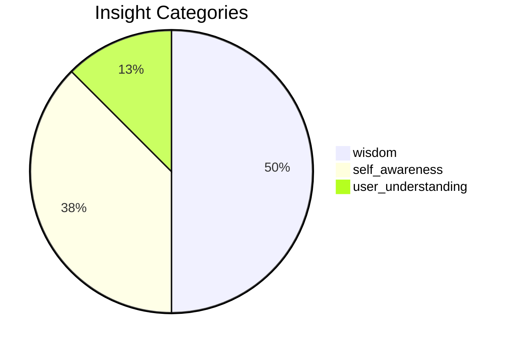

# Stage 6: Cognitive Learner

> Part of the [[../flow|Intelligence Flow]]
> Upstream: [[05-meta-ralph|Meta-Ralph]]
> Downstream: [[08-advisory|Advisory]] | [[09-promotion|Promotion]]

**Purpose:** Stores refined insights with reliability tracking, validation counts, and promotion status. Noise filter: 41 patterns. Deduplication via similarity threshold.
## Health

| Metric | Value | Status |
|--------|-------|--------|
| Total insights | 8 | healthy |
| Categories | 3 | healthy |
| Last updated | 3m ago | healthy |
## Category Distribution

## Top Insights (by reliability)

| Key | Category | Reliability | Validations | Promoted | Insight |
|-----|----------|-------------|-------------|----------|--------|
| `reasoning:bad_assumption:File exists at expected path` | wisdom | 100% | 167 | yes | Assumption 'File exists at expected path' often wrong. Reality: Use Glob to search for files before ... |
| `user_understanding:user_expressed_satisfaction_with_the_res` | user_understanding | 100% | 30 | — | User expressed satisfaction with the response |
| `user_understanding:when_using_read,_remember:_instead_of_a_` | wisdom | 100% | 27 | — | When using Read, remember: Instead of a single try/except that falls through to `_fallback_response(... |
| `self_awareness:read_failed:_file_does_not_exist._note:_` | wisdom | 96% | 78 | yes | Read failed: File does not exist. Note: your current working directory is /Users/rohnspringfield/vib... |
| `reasoning:large_edit_on_settingsdropdown.module.cs` | wisdom | 80% | 49 | yes | Large edit on SettingsDropdown.module.css (76→1162 chars). Consider smaller incremental changes for ... |
| `self_awareness:read_failed:_eisdir:_illegal_operation_o` | self_awareness | 35% | 144 | — | Read failed: EISDIR: illegal operation on a directory, read '/Users/rohnspringfield/vibeship-kait-i... |
| `self_awareness:struggle:read_error` | self_awareness | 4% | 3 | — | I struggle with Read_error tasks |
| `self_awareness:struggle:bash_error` | self_awareness | 1% | 8 | — | I struggle with Bash_error tasks |

## Source Files

- `lib/cognitive_learner.py` — Core implementation
- `~/.kait/cognitive_insights.json` — State storage
- `~/.kait/cognitive_metrics.json` — State storage
