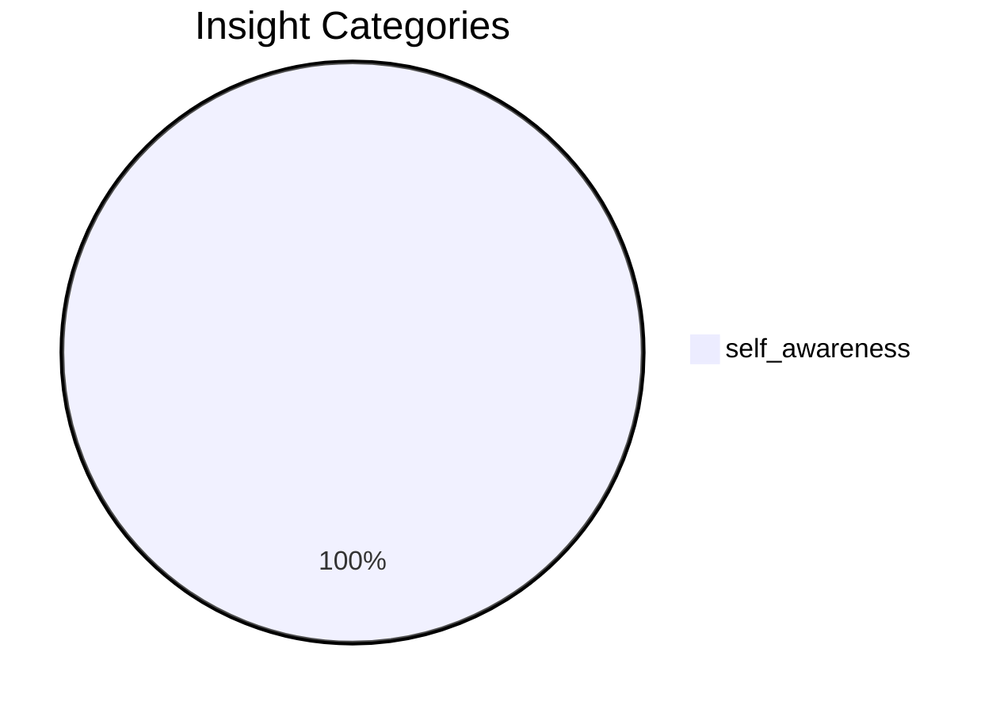

# Stage 6: Cognitive Learner

> Part of the [[../flow|Intelligence Flow]]
> Upstream: [[05-meta-ralph|Meta-Ralph]]
> Downstream: [[08-advisory|Advisory]] | [[09-promotion|Promotion]]

**Purpose:** Stores refined insights with reliability tracking, validation counts, and promotion status. Noise filter: 41 patterns. Deduplication via similarity threshold.
## Health

| Metric | Value | Status |
|--------|-------|--------|
| Total insights | 4 | healthy |
| Categories | 1 | healthy |
| Last updated | 6.7h ago | healthy |
## Category Distribution

## Top Insights (by reliability)

| Key | Category | Reliability | Validations | Promoted | Insight |
|-----|----------|-------------|-------------|----------|--------|
| `self_awareness:read_failed_5/112_times_(96%_success_rat` | self_awareness | 70% | 0 | — | Read failed 5/112 times (96% success rate). Most common: File content (39149 tokens) exceeds maximum... |
| `self_awareness:read_failed:_file_content_(39149_tokens)` | self_awareness | 55% | 0 | — | Read failed: File content (39149 tokens) exceeds maximum allowed tokens (25000). Please use offset a... |
| `self_awareness:struggle:bash_error` | self_awareness | 1% | 1 | — | I struggle with Bash_error tasks |
| `self_awareness:struggle:read_error` | self_awareness | 0% | 6 | — | I struggle with Read_error tasks |

## Source Files

- `lib/cognitive_learner.py` — Core implementation
- `~/.kait/cognitive_insights.json` — State storage
- `~/.kait/cognitive_metrics.json` — State storage
